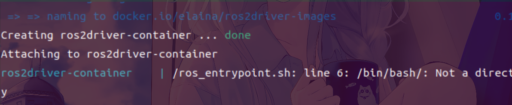
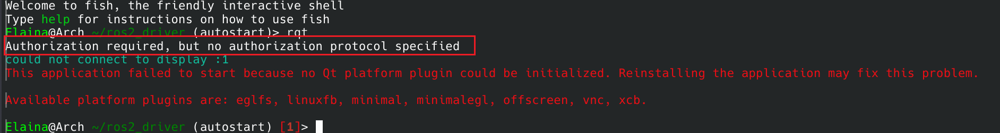

## 镜像容器与dockerhub
### 镜像
- 类，从dockerfile构建,可以指定标签
- 也可以从docker-compose.yml 构建,不推荐
- 更改是永久储存的
### 容器
- 实例,可以从一个镜像创建多个实例
- docker run 直接生成的容器是任意名字并且不会自动删除
- 在容器上进行的更改会被删除容器重新启动撤销
- 同一个名字的容器只能有一个
- 进入容器命令
- 有正在运行与停止运行两种情况,只有停止运行的容器才能被删除
```bash
ros2 run exec -it 容器名 bash/fish
```
### dockerhub
- 远程保存镜像的仓库,类似github
- 从远端拉镜像
```bash
docker pull 用户/仓库:tag
```
> 拉不了先docker login登陆
```dockerfile
ARG USERNAME=Elaina
USER $USERNAME #访问上文USERNAME
```
## dockerfile构建镜像
### 构建指令
- 通过 -t 指定标签
- 通过 -f 指定dockerfile路径, ./Dockerfile默认路径可以省略
- 最后的. 表示构建上下文和`COPY`路径有关系
```bash
docker build -f ./Dockerfile -t custom-image .
```
### 构建形式
- 每次构建都会有缓存
- 会从上次缓存改变地方开始构建
- 把测试的东西放在最后可以显著加快构建速度
### FROM命令
- 指定基础镜像源
- 可以为本地或者远端镜像
### ARG命令
- 设定dockerfile 全局变量
- 用 `${PARAM}`访问已经声明的变量
### WORKDIR命令
- 指定之后所有指令的路径
### RUN 命令
- 默认用`sh`而不是`bash`
>在dockerfile中source bash 文件比较麻烦,一般采用 `. /install/setup.sh`代替
- 一个RUN命令是一层缓存,上下文不能互通
> apt-get update也有可能不缓存
- 一般采用 `\ + &&`实现在同一个RUN里面实现多条命令
```dockerfile
RUN . /opt/ros/humble/setup.sh && cd ./ros_ws && colcon build --packages-select  serial \
    && . ./install/setup.sh && colcon build --cmake-args -DCMAKE_BUILD_TYPE=Release 
``` 
- 在忘记+ \或者&&会产生奇怪报错
### USER命令
- 指定接下去操作的用户,和权限有关
### COPY命令
- 将本地的文件复制进dockerfile
- 在本地文件发生改变时会认为本层变更
## docker compose
### 从docker compose 启动关闭容器
- 需要和的docker-compose.yml 在同一个文件夹路径时使用
```bash
docker compose up -d #-d表示后台运行 
```
```bash
docker compose down
```
### 服务名与容器名
- 不冲突就行
### image
- 指定生成容器的镜像
### volumes:  -dir:dir
- 将本地的路径挂载到容器里面
- 容器和本地的更改都会同时反映(和copy不同)
- 容器产生新的文件可能会有root权限导致本地无法更改
- 一般需要挂载工程目录,dev目录
- 需要`/tmp/.X11-unix:/tmp/.X11-unix`和`DISPLAY=${DISPLAY}`来打开图形化界面
### user:
- 指定容器的用户,默认为root
### workdir
- 指定容器的默认路径
### cmd
- 打开容器默认执行的任务,在dockerfile或者compose里面指定
- 一般为CMD ["/bin/bash"] 或者不指定
```dockerfile
version: '3'
services:
  ros2driver-service:
    image: elainasuki/rc2025:ros2_driver
    container_name: ros2driver-container
    environment:
      - DISPLAY=${DISPLAY}  
      - NVIDIA_VISIBLE_DEVICES=all
      - NVIDIA_DRIVER_CAPABILITIES=all
      - OMP_WAIT_POLICY=passive
      - TERM=xterm-256color
    volumes:
      - /tmp/.X11-unix:/tmp/.X11-unix
      - ./..:/home/Elaina/ros2_driver
      - /var/run/docker.sock:/var/run/docker.sock
      - /dev:/dev
    network_mode: host
    pid: "host" # 添加 pid 命名空间共享
    ipc: "host" # 添加 ipc 命名空间共享    
    privileged: true
    stdin_open: true
    tty: true
    user: "Elaina"
    working_dir: "/home/Elaina/ros2_driver" # 指定默认工作目录

```
## 运营维护命令
### 查看当前镜像容器
```bash
docker ps -a #查看所有容器
```
- 没有-a 只会查看正在运行的容器
```bash
docker images #查看镜像
```
### Portainer 可视化控制台
```bash
docker run -p 9000:9000 -p 8000:8000 --name portainer \
--restart=always \
-v /var/run/docker.sock:/var/run/docker.sock \
-v /mydata/portainer/data:/data \
-d portainer/portainer
```
访问 `http://localhost:9000` 进行管理

---

### 系统维护命令

| 操作类型     | 命令                                        |
| ------------ | ------------------------------------------- |
| 清理悬空镜像 | `docker image prune`                        |
| 全局清理     | `docker system prune`                       |
| 构建缓存清理 | `docker builder prune --filter "until=24h"` |

---
## 常见问题
### 需要sudo权限执行docker 命令
- 将用户添加到docker 组
###  找不到/bin/bash

- /bin/bash打成了/bin/bash/  最后的/

docker-compose.yaml中的working_dir同样路径**
### 容器里面用户使用root可能会造成问题
- 宿主机用不了docker里面创建的文件
- ros2 node list 无法发现root 启动的节点，可能还有其他问题
### GUI授权问题

```bash
sudo xhost +
```
- 还有可能是没挂载x11路径或者没设置display环境变量
### docker compose up产生大量报错
- 先看看有没有同名容器
- 有的话先停止运行然后删除
