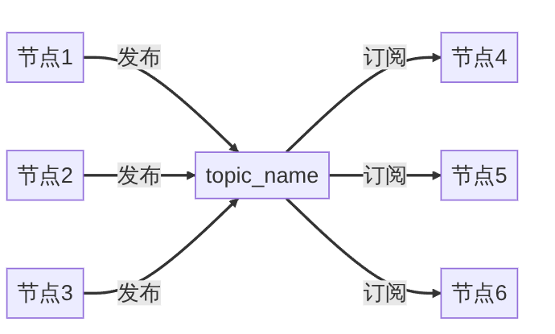
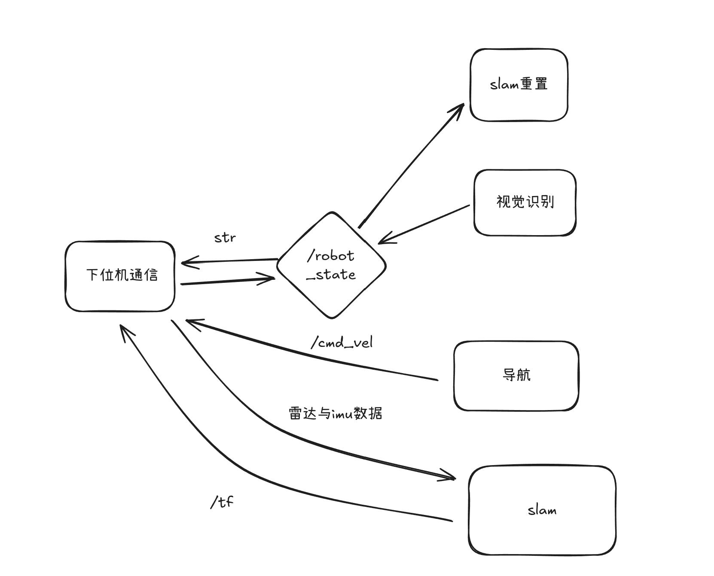
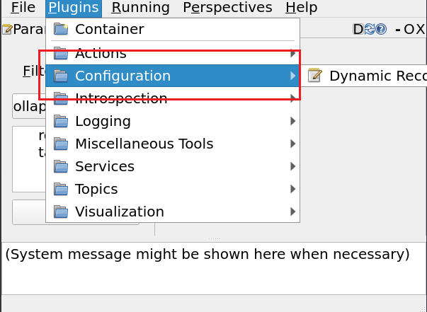
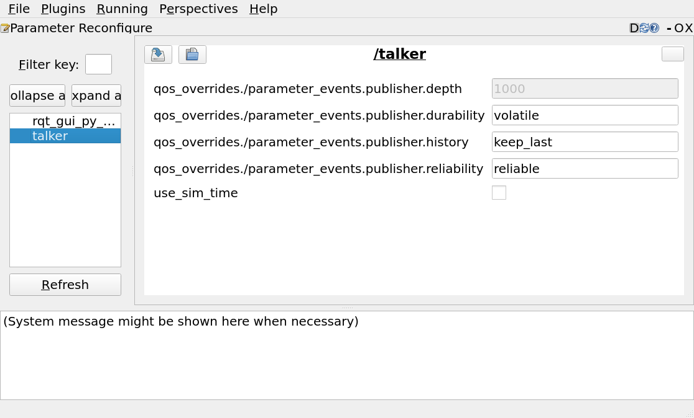
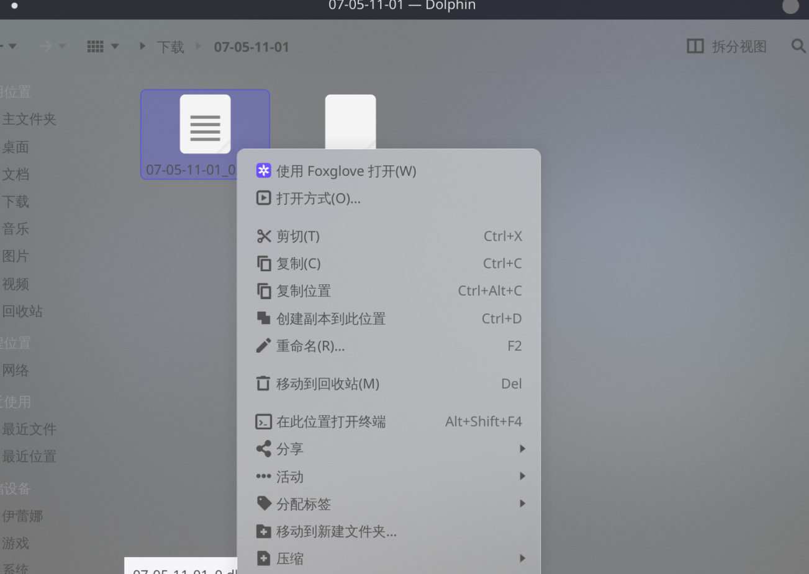

## ROS介绍
- 传感器与算法掉包工程
- 话题分模块体系

### 新建功能包与编译
ROS 工作空间
```txt
ros_ws/ #工作空间根目录 colcon build --symlink-install
|-src/ #功能包源码路径 ros2 pkg create 
|  |-package1/
|  |  |-package1_1/
|  |  |  |-CmakeList.txt
|  |  |-package1_2/
|  |  |  |-CmakeList.txt
|  |-package2/
|  |  |-CmakeList.txt
|-build/ #编译路径
|-log/ #日志路径
|-install/ #结构路径
```
> 所有的ros2 功能包都需要`source`过后使用
### 两种功能包编译工具链与两种构建命令
#### ament_cmake
- c++节点
- launch启动文件+配置文件
- python节点,***不包好***
#### ament_python
- python节点
#### colcon build
- 复制安装
- 更改任何内容都需要重新编译安装
#### colcon build --symlink-install
- 链接安装
- 更改launch文件或者python脚本可以不重新编译
##  ROS 话题
- 最基本的流程图

- 2025赛季流程图


- 任务分节点,通信靠话题
### ROS话题四要素
#### 话题名称
- 基本没坑
#### 消息类型
- 常用的为传感器消息，tf消息以及字符串消息。
- `不要`自定义消息,有特殊需求通过json+str消息类型实现
#### 服务质量+队列深度
- 巨坑
- 常见配置有`BEST_EFFORT`,`RELIABLE`与`DURABILITY`
- DURABILITY仅在tf_static中使用,不要在其他`任何地方`使用
- 队列深度+服务质量会影响高负载情况下话题数据的发送
- 把队列深度从10改到0会明显改善传感器数据的丢包情况（mid360桥接）
- [详细内容](https://mp.weixin.qq.com/s/J63fO4c_QIseLGQd5W2fAw?poc_token=HFyMsmij6mHtwf00dqkCj7_cnGW45W2UfalGPKcN)
#### 时间戳
- 巨坑,出现在传感器消息与tf等包含时间信息的消息中
- 会影响ros包录制与播放,以及节点的使用
- tf的时间戳可能导致程序卡死

一个简单的发布者与订阅者

```python
from std_msgs.msg import String
class NodeSubscribe(Node):
    def __init__(self,name):
        super().__init__(name)
        self.get_logger().info("大家好，我是%s!" % name)
        # 创建订阅者
        self.command_subscribe_ = self.create_subscription(String,"command",self.command_callback,10)

    def command_callback(self,msg):
        speed = 0.0
        if msg.data=="backup":
            speed = -0.2
        self.get_logger().info(f'收到[{msg.data}]命令，发送速度{speed}')


class NodePublisher(Node):
    def __init__(self,name):
        super().__init__(name)
        self.get_logger().info("大家好，我是%s!" % name)
        self.command_publisher_ = self.create_publisher(String,"command", 10) 
        self.timer = self.create_timer(0.5, self.timer_callback)
    
    def timer_callback(self):
        """
        定时器回调函数
        """
        msg = String()
        msg.data = 'backup'
        self.command_publisher_.publish(msg) 
        self.get_logger().info(f'发布了指令：{msg.data}')    #打印一下发布的数据
```
- 上面的String不是python自带类型,是ros2中的消息类型
## ROS 参数
- 在`源码之外`更改节点的设定值(命令行,launch)
- 参数有的支持运行时更改,有的只允许启动前更改
- 支持在`rqt`中动态显示参数


### 参数的构成
- 键值对,python字典 "key" : value
- 值的范围:int,float,bool,string和对应的列表
### 在节点中的使用
- 先要声明一个参数和默认值
- 用的时候需要取参数
```python
class Communicate_t(Node):
    def __init__(self):
        super().__init__('communicate_t')
        self.declare_parameter('serial_port', '/dev/serial_ch340')
        self.declare_parameter('serial_baudrate', 230400)
        self.serial_port=self.get_parameter('serial_port').value
        self.baudrate=self.get_parameter('serial_baudrate').value
```
- 直接通过命令行传递
```bash
ros2 run <pkg_name> <node_name> param_name:=value
```
### 参数配置文件yaml
- yaml文件头参数较为混乱
- ros2官方的标准为`节点名`+`ros__parameters`
```yaml
usb_cam_node:         //可乱变
  ros__parameters:    //可乱变
    video_device: "/dev/video4"
    framerate: 30.0
```
> 在参数少的情况下建议直接在launch中管理参数
## ROS Launch
- 启动节点,可以生成多个实例
- 给节点传递参数
- launch嵌套
### 在launch中找可执行文件
- 下面的包和可执行文件需要先source过
```python
ld=LaunchDescription()
camera_node=Node(
        package='usb_cam',
        executable='usb_cam_node_exe',
        name='usb_cam_node',
        output='screen',
        emulate_tty=True,
        parameters=[LaunchConfiguration('config_dir')]
    )
ld.add_action(camera_node)
```
> 上面的emulate_tty决定了print或者std::cout能不能直接显示到控制台上
### 在launch中找其他文件

- 用当前launch文件的相对路径找
```python
cur_path = os.path.split(os.path.realpath(__file__))[0] + '/'
cur_config_path = cur_path + '../config'
rviz_config_path = os.path.join(cur_config_path, 'display_point_cloud_ROS2.rviz')
```
- 用ros2查找功能包的api找
```python
my_package_prefix = get_package_share_directory('my_driver') #需要和功能包同名
yaml_path=my_package_prefix+'/config/realsense.yaml' #深度相机的配置文件

```
> 需要在cmake中把对应的目录添加到安装路径上
### 在launch中传参
- 静态参只需要在节点传入
```python
    communicate_node=Node(
        package='my_driver',
        executable='com.py',
        name='communicate',
        output='screen',
        emulate_tty=True,
        parameters=[
            {'serial_port': '/dev/serial_ch340', #指定节点中的动态参数
             'serial_baudrate':230400,
             }
        ]
    )
```
- 动态参要`先声明`再使用,和节点一样
- 不声明`不会`报错,但是外部参数传不进去
```python
ld=LaunchDescription()
ld.add_action(DeclareLaunchArgument('joy_topic', default_value='/joy')) #注意要先声明
ld.add_action(DeclareLaunchArgument('cmd_vel_topic', default_value='/cmd_vel'))
joy_teleop = Node(
        package='my_driver',
        executable='joy.py',
        parameters=[{
            'joy_topic': LaunchConfiguration('joy_topic'),
            'cmd_vel_topic': LaunchConfiguration('cmd_vel_topic'),
        }]
    )
ld.add_action(joy_teleop)
```
<!-- <a id = "custom-anchor">往这跳</a> -->
- 对于bool动态参数并不能直接获得值来参与 if 运算
- 静态参数与动态参数指从命令行或者launch启动launch的时候能不能更改参数值
### launch嵌套launch
- 需要先找到被调用launch
- 传递参数和node有不同
```python
mid360_launch=IncludeLaunchDescription(
        PythonLaunchDescriptionSource(
            os.path.join(get_package_share_directory('my_driver'),'launch','mid360_dd.launch.py')
        ),
        launch_arguments={
            'use_rviz': 'false',  #不启动rviz
        }.items(),
    )
```
> 上面的launch参数在最外面要加一个`.items()`,找launch方式是[前文](#在launch中找其他文件)
### 更改驱动launch
- 复制原始的launch文件
- 更改配置文件路径
## ROS Bag
- 记录数据包与播放数据包
- ros2 数据包一般是数据包.db3+metadata.yaml ros1一般是数据包.bag
- 可以用`foxglove`直接对数据包可视化

- 在录制数据包时候有时会出现写入问题,没查明问题
- 播放时候默认是单次播放1倍速率,在重复播放时候会遇到时间戳问题
