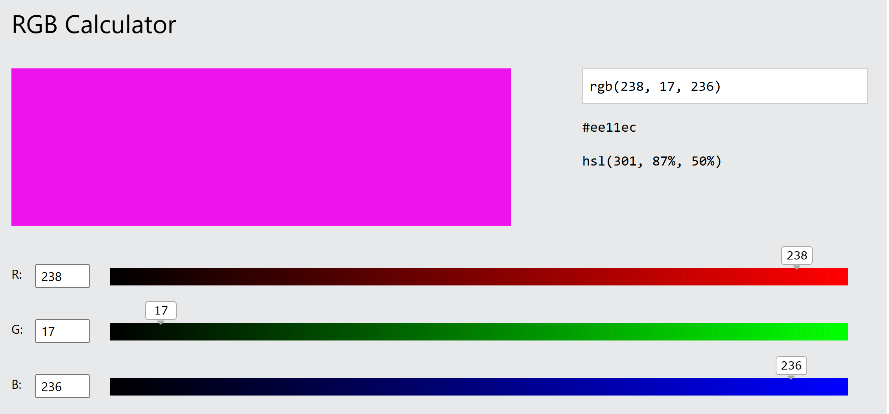
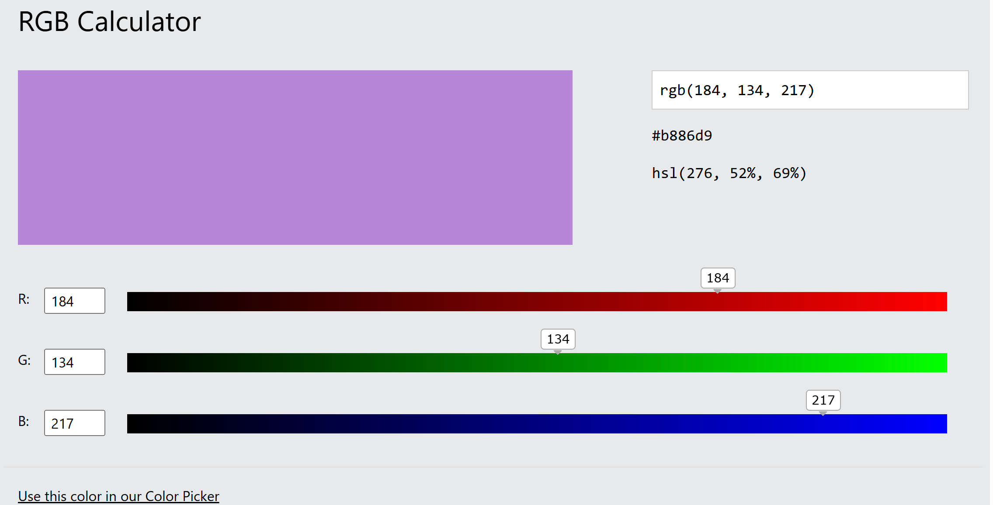
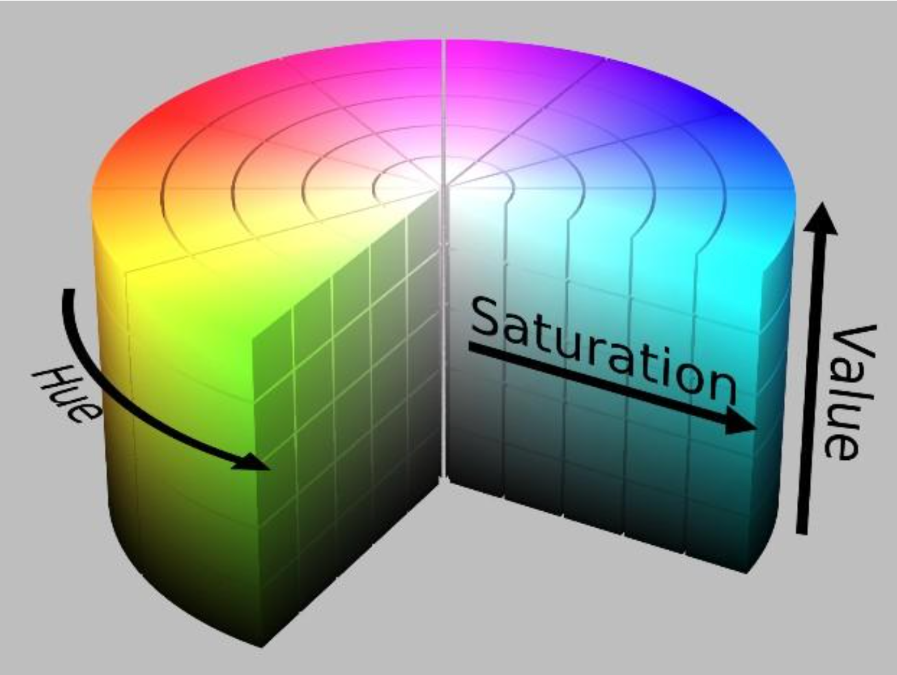
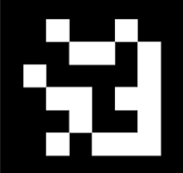
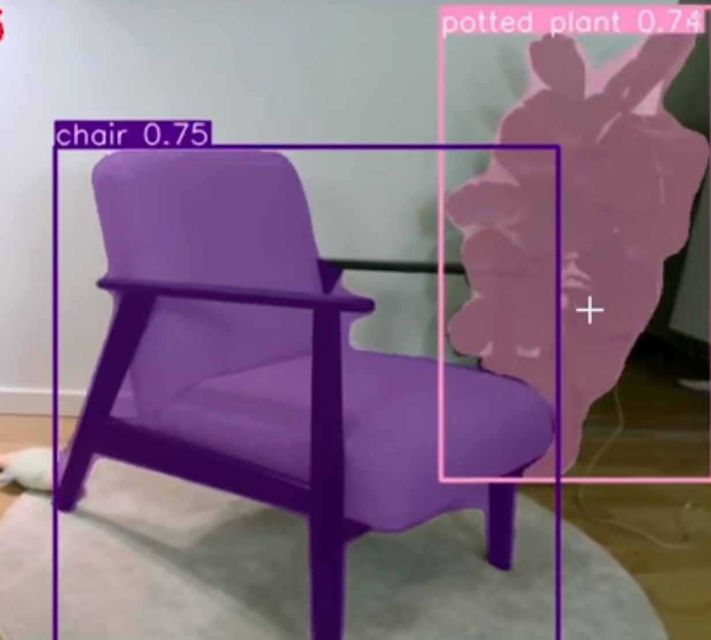
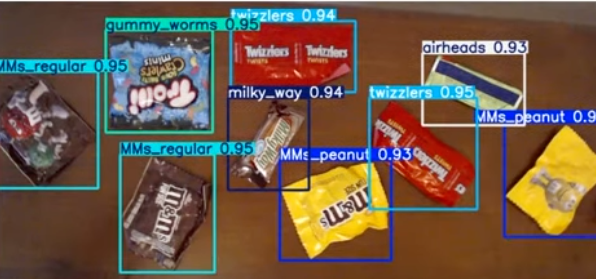

## OPENCV
- 图像处理库,一般使用python版本 
- 可以调用gpu或者npu加速
- 常见图像颜色处理,滤波与边缘提取
- 一般流程: opencv对原始图像做滤波或者调色,给yolo做处理
### 获得输入源的函数
```python
cap = cv2.VideoCapture('example.mp4')
cap = cv2.VideoCapture("/dev/*")
```
- 和ros2 的结合
```python
  def compressed_image_callback(self, msg: CompressedImage):
        """处理压缩图像消息的回调函数"""
        try:
            self.image = self.bridge.compressed_imgmsg_to_cv2(msg, "bgr8")
            self.process_image()
        except Exception as e:
            import traceback
            self.get_logger().error(f"堆栈跟踪: {traceback.format_exc()}")

    def regular_image_callback(self, msg: Image):
        """处理非压缩图像消息的回调函数"""
        try:
            self.image = self.bridge.imgmsg_to_cv2(msg, "bgr8")
            self.process_image()
        except Exception as e:
            import traceback
            self.get_logger().error(f"堆栈跟踪: {traceback.format_exc()}")
```
### 显示图像
- 一定要有waitKey不然不会有图像显示
```python
cv2.imshow("Detection Result", drawn_image)
cv2.waitKey(1)
```

## hsv与rgb色彩空间
- rgb 三原色
- 缺点:相同色域的rgb值差别大,不好调



- hsv 色相,饱和度,明度
- 极坐标,相似色相更容易区分

> 还有明度亮度空间
## aruco码识别与pnp解算
### aruco码
- 可能能成为今年的两车通信方式
- 类似二维码,但是码的总量较少



- 可以直接输入彩色图像
- opencv中有识别函数,在2025赛季也进行过封装
- 返回值是四个点在图像中的像素坐标

> 基本不能有遮挡

## pnp 解算
[视频链接](https://www.bilibili.com/video/BV1TM4y1d7x5/?spm_id_from=333.337.search-card.all.click)

- 输入`一个面` 的四点坐标和相机内参可以算出来平面和自身距离

### 存在问题
- 像素点之间的间隔不能太小,否则会放大误差
- 平面不能和相机成完全垂直的关系,否则误差较大

## pnp+aruco码
在队友车上放置aruco码,检测出四个角点输入pnp算法可以算出两车之间距离

## YOLO
- 目标检测
- 可以进行npu加速 +  `OpenVINO`模型化简
- 需要提前训练

- [yolo加速推理](https://docs.ultralytics.com/integrations/openvino/#using-openvino-export-in-deployment)
### 实例分割
- 可以得到标签和像素点集

### 分类 
- 可以获得标签和边框的像素点位置


### 遇到过的坑
- yolo获得的结果较为复杂,应该在debug模式下看一遍
```python
results = self.model(image)
corners = []
# 筛选有效掩膜
valid_masks = self._filter_valid_masks(results, confidence_threshold) 
```
- yolo的可视化可能会导致阻塞
- 变成1s 三帧,内部有300ms延迟
```python
results=self.model(image)
# 把结果显示到图片上
#创建一个空的图像对象
segmentation_mask = np.zeros_like(image, dtype=np.uint8)
if self.show:
    # cv2.addWeighted(image, 1, segmentation_mask, 0.7, 0, image)  # 将修改写回原图像
    result = results[0]
    image_result= result.plot()   #罪魁祸首
    #将image_result内容给image
    image[:]=image_result
```
