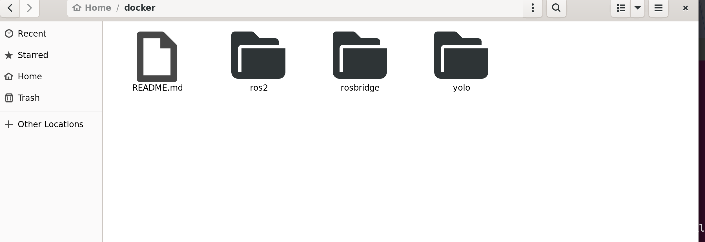
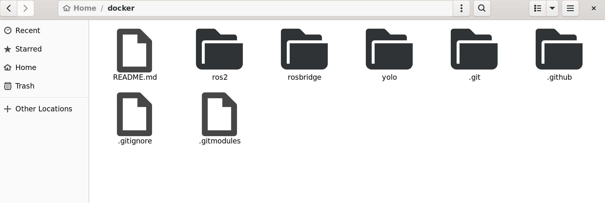
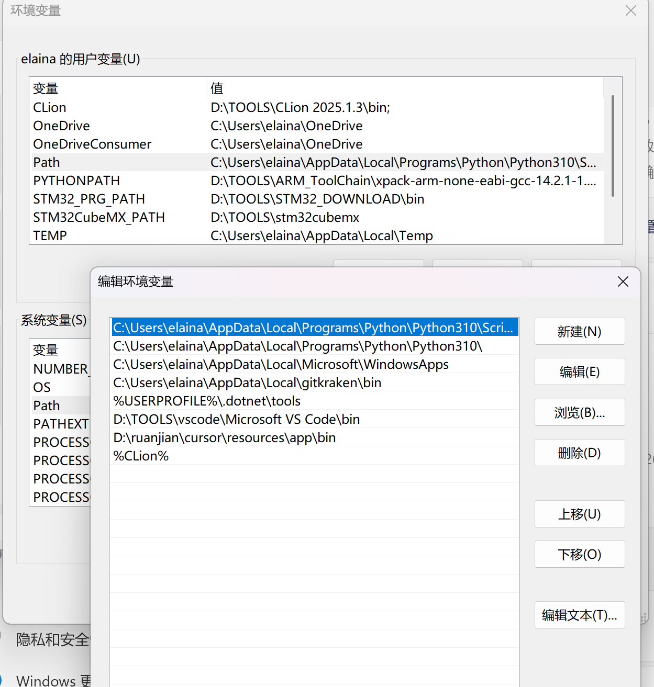

## linux 刷机
#### 教程
- [视频链接](https://www.bilibili.com/video/BV12K4y1F785/?spm_id_from=333.1387.upload.video_card.click&vd_source=06e762db6f7d89c2c0b221aa1e7a401d)
- 将上述视频中的移动设备直接选择成为移动硬盘就行
- 想进入linux在电脑启动bios界面选择从移动硬盘启动
#### 常见问题
- 出现黑屏或者闪退重启: 在电脑bios界面配置UEFI启动
## linux 常见问题:
#### 1 隐藏文件的显示
有些小可爱会发现自己的终端或文件管理器会少目录(其实是自己没开隐藏文件显示)

<div align="center" >
<h6>显示隐藏文件前</h6>
</div>


<div align="center" >
<h6>显示隐藏文件后</h6>
</div>

按`ctrl+H`可以显示隐藏文件<br>
如果在终端里面可以用下面命令显示当前文件目录下所有隐藏文件
```bash
ls -a 
```

#### 2 linux中的权限
 - 在linux中不是所有的文件或者命令在创建时候都有可执行文件<br>
 - 一般包括设备与bash文件,特征为打不开设备或者提示命令权限不够<br>
 - 其中bash文件不能通过sudo指令运行
 - 给权限的万能指令包括
 ```bash
 sudo chmod +x path_to_your_file
 ```
 ```bash
 sudo chmod +777 path_to_your_file
 ```

#### 3 linux命令构成:包括`用户+路径+命令`

- 在上述命令中1为用户 2为路径 3为命令 <br>
- 这个命令完整表示 elaina用户在~/docker/ros2路径下执行./packages/librealsense/scripts/setup_udev_rules.sh命令
- 可以通过用户来判断是否在docker里面
#### 4 linux命令路径
在linux命令运行时默认路径为2.1中的路径。**. 也表示当前目录**,**.. 表示上级目录**

在上面图片中的根路径(命令开始执行的路径)可以表示为
```bash
elaina@Elainapc:~/docker/ros2$
```
如果要访问其中的packages文件可以有两种写法
```bash
elaina@Elainapc:~/docker/ros2$ packages/
```
或者
```bash
elaina@Elainapc:~/docker/ros2$ ./packages/
```
如果要表示它的上级目录docker
```bash
elaina@Elainapc:~/docker/ros2$ ./../
```
## 依赖介绍
指一个工程中调用他人代码的部分,分为静态依赖和动态依赖。
#### 1. 静态库:
- 在链接编译时候就需要用到的依赖
- 缺少的情况下会直接安装失败 
```bash
CMake Error at CMakeLists.txt:62 (find_package):
  By not providing "Findlivox_ros_driver2.cmake" in CMAKE_MODULE_PATH this
  project has asked CMake to find a package configuration file provided by
  "livox_ros_driver2", but CMake did not find one.
```
#### 2. 动态库:
- 在程序运行的时候用到的依赖
- 缺少的情况下可能导致编译出错
```bash
undefined reference to 'function_name' 或 ld: cannot find -lxxx
```
- 还会导致程序运行的时候出现报错
``` bash
error while loading shared libraries: libxxx.so.x: cannot open shared object file: No such file or directory
```
#### 3.环境变量:
- 系统的全局变量(💩👍)

- 有多值的环境变量,一般为路径。比如python包路径,可执行文件路径
- 多值添加
```bash
PATH=${PATH}:PATH2 #在原来的路径后面添加新的路径
```
## linux的包管理系统
#### 1. apt包管理
- ubuntu下最常见安装软件包的工具
- 常用命令有
```bash
sudo apt update #更新软件源索引
sudo apt install <package-name>#安装指定软件包
```
- 直接安装二进制文件不需要编译
- 不开梯子情况与重新刷机后需要换源
- **不能处理双版本依赖问题**
#### 2. ppa包管理
- 个人软件包仓库,为官方apt仓库的拓展,提供更全和更新的依赖包
- 添加ppa源
```bash
sudo add-apt-repository ppa:<user>/<ppa-name>
```
- 更新apt 索引,与安装软件包,命令同apt
#### 3. rosdep 💩
- 快跑,别用
- 基本没有专门的ros依赖
- 它能安装的ros包apt一样可以安装
#### 4. cmake 全局安装
- 当没有apt或者ppa的时候**必用** ~~(或许可以试试arch 或者Alpine)~~
- 手动拉取源文件进行编译安装  
#### cmake常见安装问题如下
- 你安装的cmake依赖还有cmake依赖
- 你拉取的版本过不了编译要改代码
- 拉取的版本不对导致会有些函数或者文件不存在
> 点名opencv2 与opencv
### vscode开发工具
采用vscode+插件的模式进行开发
- 可以自定义任务+debug(settings.json,launch.json,tasks.json)
- settings.json是插件设置
- launch.json负责调试设置,会调用tasks.json
#### 插件推荐:
- 这里的区域以后再来探索吧
### 任务: 在linux中安装Voxel-SLAM
> 温馨提醒:ubuntu**22.04**无法安装这个项目
- 禁止使用docker 
- 项目链接 https://github.com/hku-mars/Voxel-SLAM
> 验收时间:3天后
