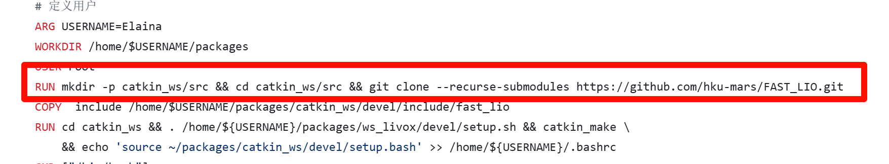

### 网络问题
- 没开梯子或者宿舍网太烂
### 不使用FROM源
```dockerfile
FROM ros:humble-ros-base

RUN apt-get update && apt-get install -y \
    ros-humble-desktop ros-humble-pcl-conversions ros-humble-pcl-ros \ //gpt
    git build-essential cmake wget curl vim sudo \
    libpcl-dev libeigen3-dev libboost-all-dev \
    python3-pip python3-rosdep python3-colcon-common-extensions \
    x11-apps mesa-utils \
```

- 在apt安装ros2大的依赖而不是在from源,容易出问题
- 可以进对应仓库的tag看有什么镜像
### 把大文件COPY进去

- 不要拉屎
### 使用git子模块+COPY


- 比上面好点
- 会对版本管理造成影响
### 在dockercompose.yml里面构建


- 目前没问题,在使用开发容器的时候会造成二次构建问题


## docker流程
### 文件路径


- docker相关基本放在.devcontainer目录下
> 上面的src是ros2 功能包的src路径

### 大文件处理

- 在dockerfile里面clone仓库,不直接clone到本地或git 子模块管理
- 小文件与略微更改文件再考虑通过copy复制进镜像
### 构建相关
- 创建一个build.bash 给`777权限`
- 通过 .devcontainer/build.bash构建而不是docker compose 构建
> 因为devcontainer的原因