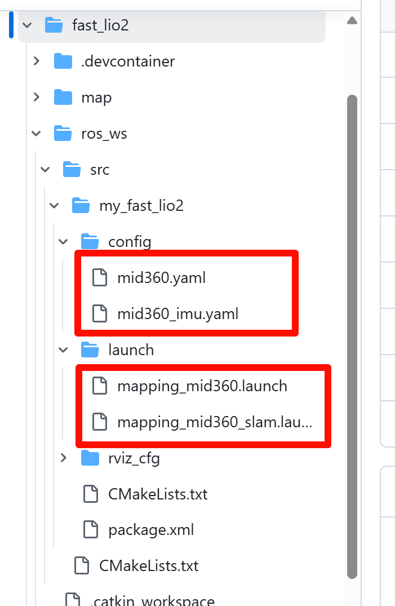

### 网络问题
- 没开梯子或者宿舍网太烂
### 不使用FROM源
```dockerfile
FROM ros:humble-ros-base

RUN apt-get update && apt-get install -y \
    ros-humble-desktop ros-humble-pcl-conversions ros-humble-pcl-ros \ //gpt
    git build-essential cmake wget curl vim sudo \
    libpcl-dev libeigen3-dev libboost-all-dev \
    python3-pip python3-rosdep python3-colcon-common-extensions \
    x11-apps mesa-utils \
```

- 在apt安装ros2大的依赖而不是在from源,容易出问题
- 可以进对应仓库的tag看有什么镜像
### 把功能包COPY进去/在本地挂载上去

- 不要拉屎
- 起码把非源码部分删除了
> 对不怎么更改源码的ros包都推荐下面的工作流

### 使用git子模块+挂载


- 比上面好点
- 会对版本管理造成影响
> 对不怎么更改源码的ros包都推荐下面的工作流
### 在dockercompose.yml里面构建


- 目前没问题,在使用开发容器的时候会造成二次构建问题

### slam 没跑起来
- 没有更改参数

- 只改了话题名没改雷达类型会同一个话题但是有两个话题类型

### 改参数问题
- 本地改参数COPY进去需要重新构建镜像
- 在非挂载目录下更改功能包参数,容器重新启动或在别人电脑上跑会导致更改缺失
- 挂载目录加git子模块,更改会对版本管理产生较大问题
### 改参流程

- 把官方的yaml 和launch 复制一份到自己的功能包里面
- 改自己功能包里面的launch,只有launch和参数的功能包
## docker流程
### 文件路径
#### 1.src在vscode根目录下


- 伴随.vscode文件夹,一般是自己写源码的docker 
- docker相关基本放在.devcontainer目录下
- 上面的src是ros2 功能包的src路径
- vscode 打开的目录就表示一个ros 工作空间
#### 2.ros_ws在vscode根目录下

- ros_ws/src 表示功能包的源码目录
- 一般是只有Launch的掉包docker
### 依赖包处理处理

- 在dockerfile里面clone仓库,不直接clone到本地或git 子模块管理
- 小文件与略微更改文件再考虑通过copy复制进镜像
- 不经常更改的大文件不会放到自己的工作空间下(删除install目录后需要重新构建)
### 构建相关
- 创建一个build.bash 给`777权限`
- 通过 .devcontainer/build.bash构建而不是docker compose 构建
> 因为devcontainer的原因